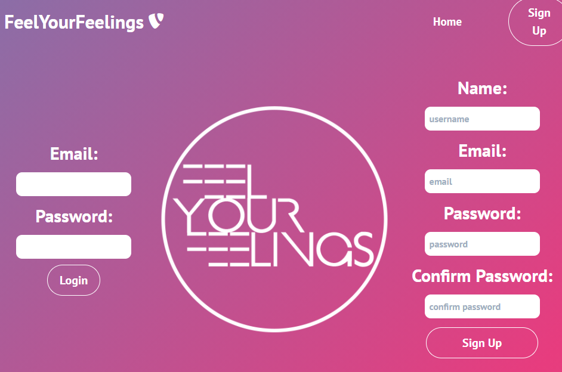

# Feel Your Feelings App

## Description
For this project we will be building a full stack mern app! We want to solve a real life problem and our site will be user friendly. Feel-your-feelings is an app designed for anyone who has a hard time finding time for themselves. Since the pandemic some people have had to live remotely or isolate themselves and this app aims to remove lonliness and with this app self-care is only a click away! Pick a mood from our categories and enjoy some alone time with your feelings! After you choose a mood you will be presented with drink options and a playlist to enjoy your drink and indulge in some self care!

## User Story
Our user is anyone who is looking to make self-care a priority or lives alone and wants to enjoy their own company. Users will be able to pick a mood that they are feeling and based on the mood chosen the user will be presented with a playlist and drink options to enjoy while listening to the playlist.Our app is designed with everyone in mind so the drink options also include non-alcoholic drinks.

## Directions
After a user signs up or login they will be able to choose a type of mood that they are in. After they choose a mood the user will be presented with a list of ten songs and a list of three drink options that they can make at home

## Acceptance Criteria
Given when opening the app and the user can sign up or login
Given when after loging in the user can choose from our categories of 10 moods
Given after choosing a mood the user will be presented with a playlist of 10 songs and 3 drink options

## Mock-Up 
() 

## Collaborators 
Alejandro Gonzalvez
Henry Parras
Lillie Jirpattanalak
Nancy Gonzalez

No copyright intended for educational purposes only